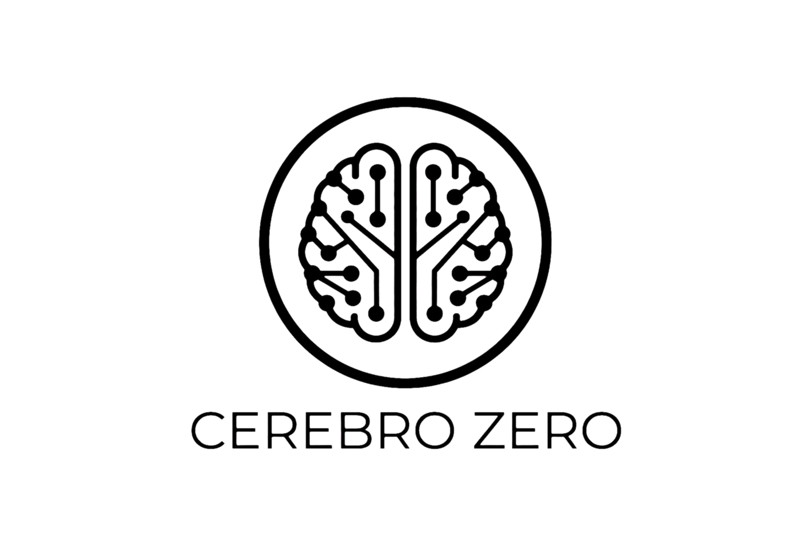

# CEREBRO ZERO

<p align="center">
  
</p>


## Autonomous Learning Cognitive Agent

[](https://www.python.org/)
[](https://numpy.org/)
[](tests/)
[](https://github.com/lecodev-26/cerebro-zero/actions/workflows/ci.yml)
[](LICENSE)
[](#serialization)
[](https://termux.dev/)

---

## 🎬 Demo


*A complete cognitive agent built from scratch on Termux (Android + NumPy). No frameworks. No shortcuts.*

---

## 📖 Description

**Cerebro Zero 4.0** is a **fully-integrated cognitive agent** built **from scratch** in Python + NumPy. No ML frameworks. No `pickle`. Every component is verified with gradient checking and tests.

**Philosophy 4.0 — System Integrity:**
> 2.1 = verifiable system.
> 3.0 = system that learns, plans and acts verifiably.
> 4.0 = system that proves its integrity: zero pickle, transactional learning, honest benchmarks.

---

## 🏆 Achievements 4.0

| Area | Status |
|------|--------|
| **Tests** | ✅ 762/762 passing |
| **Autograd** | ✅ Verified with gradient checking |
| **Transformer** | ✅ REAL backprop (17/17 gradients) |
| **Cognitive Pipeline** | ✅ CerebroV3 integrated (10 components) |
| **Planner 3.0** | ✅ Goal → Subgoals → Dependencies → Actions |
| **Learning Engine** | ✅ Transactional Commit/Rollback with weight restore |
| **RL basics** | ✅ Q-Learning + GridWorld (~99% success) |
| **Tokenizer 3.0** | ✅ Byte-level + BPE from scratch |
| **Tool System 3.0** | ✅ Contracts + permissions + schemas |
| **Reproducibility** | ✅ Environment fingerprints + config hash |
| **Serialization** | ✅ **Zero pickle** across active tree (JSON + NPY) |
| **Repository** | ✅ Clean tree with `legacy/` archive |
| **Sandbox** | ✅ Subprocess + timeout + temp cwd |
| **CI/CD** | ✅ Unified GitHub Actions CI across Python 3.10–3.14 |
| **CLI** | ✅ `cerebro-zero info/chat/plan/benchmark` |
| **Visual** | ✅ Rich terminal output + Pillow-generated plots |
| **E2E** | ✅ Real CerebroV3 benchmark + system tests |
| **Memory index** | ✅ Lexical pre-index + vectorized retrieval |
| **KV cache** | ✅ Incremental Transformer inference cache |

---

## 🎯 What works in 4.0

### **Mathematical core**
- Tensor with full autograd
- Correct backward broadcasting
- Exhaustive gradient checking
- Float32/float64 configurable

### **Transformer with REAL backprop**
- Multi-Head Attention with causal mask
- LayerNorm with correct gradients
- Residuals and FFN
- **Verified: 17/17 parameters with sampled gradient check**

### **Cognitive memories**
- **Working Memory**: limited capacity, TTL, priority, reinforcement
- **Procedural Memory**: learn *how* to do things
- **Semantic Memory**: similarity search
- **World Model**: persistent world state with nested paths

### **Planner 3.0**
- Decomposition: Goal → Subgoals → Dependencies → Actions
- Topological order (Kahn's algorithm)
- Cycle and broken-dependency detection
- Domain templates: train, evaluate, remember
- Step-by-step execution

### **Learning Engine (4.3 — transactional)**
- Records experiences: state, action, result, reward, error
- Experience replay
- **Snapshot / rollback** of weights
- **Golden rule:** the model is NEVER modified without objective improvement
- Commit on improvement, rollback on regression, rollback on error

### **RL basics**
- NxN GridWorld with obstacles
- Tabular Q-Learning with epsilon-greedy
- Training and no-exploration evaluation
- ~99% success rate after training

### **Tokenizer 3.0**
- **ByteTokenizer**: 256 bytes + 4 special tokens, handles any text
- **BPETokenizer**: Byte Pair Encoding from scratch
- Real compression (up to 6.5x on seen words)
- Handles emojis, accents, Chinese, rare symbols

### **Tool System 3.0**
- `ToolSpec`: declarative contract (input, output, permissions, capabilities)
- Schema validation (types, min/max, required, default)
- Search by capability and text
- Execution history and stats

### **Benchmark 4.0**
- Categories: math, memory, planning, rl, learning
- Scientific metrics: accuracy, exact_match, error_rate, latency_p50/p95
- Splits: KNOWN, UNSEEN, ADVERSARIAL
- Reproducible with seed

### **Reproducibility**
- `hash_estructura`: deterministic, order-independent
- `hash_archivo`: SHA256 chunked
- `EntornoCaptura`: Python, NumPy, platform, hardware, git commit
- `RegistroExperimento`: unique fingerprint per experiment
- Reproducibility verification with tolerance

### **Serialization (4.2 — zero pickle)**
- `core/serialization.py`: JSON + NPY for dicts with ndarrays
- `core/serialization_v2.py`: recursive support for nested dicts/lists
- Checksums SHA256, corruption detection
- Inspeccionable with `cat`
- **Zero `pickle` in the active tree** (legacy archive only)

### **Sandbox & security (4.8)**
- Subprocess isolation with temporary working directory
- Timeout enforcement and output limits
- POSIX CPU/file/process/file-descriptor limits where supported
- Python isolated mode and reduced child environment
- Persistent audit log
- Platform-aware: Termux/Android does not provide Linux namespaces/seccomp isolation through this Python layer

### **Repository cleanup (4.1)**
- All legacy code moved to `legacy/` with its own README
- Active tree: 20 clean modules
- Legacy tests separated in `tests/legacy/`

### **Visual layer**
- `utils/visual.py`: rich-based semantic helpers (ok/warn/error/info, tables, panels)
- `utils/plots.py`: Pillow-generated PNG learning curves
- Live progress bars during training

---

## 🚀 Installation

```bash
git clone https://github.com/lecodev-26/cerebro-zero.git
cd cerebro-zero
pip install -r requirements.txt
pytest tests/ -v
```

Requirements

```
numpy>=1.20
rich>=15.0
tqdm>=4.70
pillow>=12.0
```

Optional:

```
flask>=3.0        # for the legacy dashboard (moved to legacy/)
```

---

🖥️ CLI

```bash
# Version
python cli.py --version

# System status
python cli.py info

# One-shot chat
python cli.py chat "5 + 3"

# Interactive chat
python cli.py chat

# Generate a plan
python cli.py plan "Train the model"

# Run benchmark
python cli.py benchmark

# Run tests
python cli.py test
```

---

🧠 Usage example

```python
from agent.cerebro_v3 import CerebroV3

cerebro = CerebroV3(nombre="Zero")

# Math (tool)
cerebro.procesar("5 + 3")           # → "5.0 + 3.0 = 8.0"

# Learn / recall (world model)
cerebro.procesar("aprende color = azul")
cerebro.procesar("recordar color")   # → "💭 Recuerdo: color = azul"

# Plan (Planner 3.0)
r = cerebro.procesar("Entrenar el modelo")
r.plan                                # → Plan with 8 subgoals

# Stats
cerebro.stats()
```

---

📁 Structure

```
cerebro-zero/
├── agent/            # CerebroV3 (integration)
├── config/           # YAML config
├── core/             # Tensor, autograd, layers, transformer, serialization
├── datasets/         # Datasets
├── docs/             # Documentation
├── evaluation/       # Benchmark 4.0, reproducibility
├── language/         # Tokenizer 3.0, vocabulary
├── memory/           # Working, Procedural, World, Semantic
├── mobile/           # Optimizer, metrics, quantizer
├── models/           # Brain, MLP, Transformer
├── reasoning/        # Planner 3.0
├── security/         # Permissions, sandbox, process
├── tests/            # 742 active tests
├── tools/            # Tool System 3.0 + plugins
├── training/         # LM Trainer, Learning Engine, RL
├── utils/            # Visual (rich) + Plots (Pillow)
├── legacy/           # Historic code (archived, not executed)
├── assets/           # Demo GIF and images
├── cli.py            # CLI
└── pyproject.toml    # Packaging
```

---

📊 Benchmark 4.0

Run:

```bash
python cli.py benchmark
```

Metrics:

· Global accuracy
· Per category (math, memory, planning, rl, learning)
· Per split (KNOWN, UNSEEN, ADVERSARIAL)
· Latency p50, p95
· Error rate

---

🗺️ Roadmap

See ROADMAP.md for the full breakdown.

Completed

· ✅ Phases 1-20: Neural core (Tensor, autograd, layers)
· ✅ Phases 21-40: Central brain, Transformer, engineering
· ✅ Phases 2.1.1-2.1.8: Technical Integrity Release
· ✅ Phases 3.1-3.13: Autonomous Learning Cognitive Agent
· ✅ Phase 4.0.1: Honesty Fix (documentation audit)
· ✅ Phase 4.1: Repository Cleanup
· ✅ Phase 4.2: Serialization 2.0 (zero pickle)
· ✅ Phase 4.3: Learning Transactions (rollback)
· ✅ Visual Block F1-F2: rich + Pillow

Status

· Version: 4.0.0 — release complete
· Tests: see the live CI badge and `pytest --collect-only -q` for the current count
· 4.4 E2E Benchmark: ✅
· 4.5 E2E Testing: ✅
· 4.6 Memory Indexing: ✅
· 4.7 Transformer KV-cache: ✅
· 4.8 Security Hardening: ✅
· 4.9 Unified CI: ✅
· 4.10 Scientific Release: ✅
· 4.11 Documentation 4.0: ✅

---

⚠️ Known limitations

Cerebro Zero 4.0 is an educational laboratory with explicit technical limitations.

Benchmark

· The release benchmark now exercises the real CerebroV3 pipeline in `evaluation/benchmark_e2e.py`.
· The legacy handler benchmark remains as a component-level reference suite.

Security

· Subprocess, timeout, output, and POSIX resource controls are enabled where the platform supports them.
· Termux/Android does not expose Linux namespaces/seccomp isolation through this Python layer, so this is not a full OS sandbox.
· Network isolation is not claimed.

Gradient checking

· Transformer gradient checking remains sampled rather than exhaustive over every tensor element.

Performance

· Semantic memory now uses a lexical pre-index plus vectorized candidate scoring.
· Transformer inference has an incremental KV-cache.
· Other subsystems may still contain O(n) operations by design.

Legacy code

· `legacy/` contains historical code and old pickle-based artifacts.
· Legacy artifacts are excluded from the active package and active test tree.

---

🔎 Discoverability

Cerebro Zero is intentionally described with searchable terms used by the project itself: **from-scratch AI, cognitive agent, autonomous learning, Python, NumPy, autograd, Transformer, memory, planning, reinforcement learning, tokenizer, reproducibility, Termux, Android**. These are descriptive project keywords, not a claim about search ranking.

---

🤝 Contributing

See CONTRIBUTING.md.

---

📄 License

MIT — see LICENSE.

---

👨‍💻 Author

Manuel (lecodev-26)

· GitHub: @lecodev-26
· Email: axiomsystemsechepares@gmail.com

---

Built with 🧠 and ☕ from a Samsung A16 running Termux.
